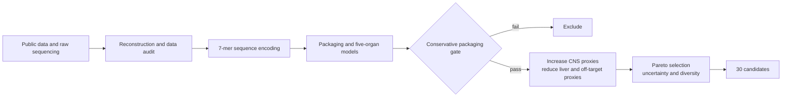

<div align="center">
  <h1>LIFS-Comp_AAV9</h1>
  <p><strong>Computational AAV9 capsid design for an SMA application context</strong></p>
  <p>Packaging constraints · multi-organ prediction · CNS/liver trade-offs · diverse candidate selection</p>
  <p>
    <a href="README.md"><strong>English</strong></a>
    ·
    <a href="README.zh-CN.md">简体中文</a>
    ·
    <a href="docs/README.md">Documentation</a>
    ·
    <a href="MODEL_CARD.md">Model Card</a>
    ·
    <a href="docs/SUBMISSION_GUIDE.zh-CN.md">Submission guide</a>
  </p>
  <p>
    
    
    
    
  </p>
</div>

<p align="center">
  
</p>

## Overview

This project uses public Fit4Function data to build a computational screening
workflow for AAV9 capsids carrying a 7-mer insertion. It asks whether predicted
packaging fitness can be retained while prioritizing candidates with higher
brain and spinal-cord distribution proxies and lower liver and other-organ proxies.

The intended application context is future SMN1 delivery for spinal muscular
atrophy (SMA). Current outputs are computational priorities based on mouse-organ
data. They do not establish motor-neuron specificity, human transferability, or
therapeutic efficacy.

## Results at a glance

| Screening stage | Result |
| --- | ---: |
| Deterministic virtual pool | 1,000,000 unique 7-mers |
| Conservative packaging gate | 6,016 passed |
| Strict Pareto set | 169 candidates |
| Final diversity-aware panel | 30 candidates |
| Full conservative checks | 7/30 candidates |

The retained five-member shared MLP ensemble achieved the following Pearson
correlations in the recorded Animal 4 development-holdout evaluation:

| Brain | Spinal cord | Liver | Heart | Kidney |
| ---: | ---: | ---: | ---: | ---: |
| 0.554 | 0.571 | 0.785 | 0.458 | 0.635 |

Animal 4 results were inspected during model development, so this is a
development-holdout evaluation rather than a final blind test. See the
[evidence summary](docs/EVIDENCE_SUMMARY.md) and [Model Card](MODEL_CARD.md).

## Computational workflow



The models predict packaging, brain, spinal cord, liver, heart, and kidney
endpoints separately. A presentation score is calculated after fitting:

```text
F_CNS = 0.50 × F_brain + 0.50 × F_spinal
F_off = 0.50 × F_heart + 0.50 × F_kidney
S     = 0.45 × F_CNS − 0.35 × F_liver − 0.20 × F_off
```

The packaging lower bound acts as an eligibility gate. Endpoint predictions,
Pareto relationships, model disagreement, and sequence distance are then used
to assemble a diverse panel from the eligible set.

## Quick start

### 1. Install

With `uv` already installed:

```bash
uv sync --frozen --extra dev
source .venv/bin/activate
```

Alternatively, use a Python virtual environment:

```bash
python3 -m venv .venv
source .venv/bin/activate
python -m pip install -e '.[dev]'
```

### 2. Run the self-contained example

```bash
python -m aav9_sma demo --output-dir artifacts/demo
```

This command uses deterministic synthetic data to check the data-audit,
prediction-table, packaging-gate, and ranking interfaces. It requires no
external research data and does not load the historical trained model.

### 3. Verify saved results

```bash
PYTHONPATH=src python scripts/verify_submission.py
```

`integrity_ok` reports file and saved-result consistency. `submission_ready`
reports whether every declared delivery item has been resolved. They are
reported separately.

### 4. Run software checks

```bash
ruff check .
pytest
```

## Key files

| File | Contents |
| --- | --- |
| [results/results.csv](results/results.csv) | 30 candidates and endpoint predictions |
| [results/results_manifest.json](results/results_manifest.json) | Result version, provenance, and checksums |
| [MODEL_CARD.md](MODEL_CARD.md) | Model architecture, evaluation, and available artifacts |
| [docs/EVIDENCE_SUMMARY.md](docs/EVIDENCE_SUMMARY.md) | Evaluation interpretation and evidence scope |
| [docs/DATA_CONTRACT.md](docs/DATA_CONTRACT.md) | Input and output field definitions |
| [docs/audit_data/](docs/audit_data/) | Machine-readable evaluation and data-quality records |
| [docs/SUBMISSION_GUIDE.zh-CN.md](docs/SUBMISSION_GUIDE.zh-CN.md) | Delivery, verification, and packaging instructions |

## Repository structure

```text
LIFS-Comp_AAV9/
├── configs/           # Model and screening configuration
├── data/              # Local research-data directories
├── docs/              # Technical documentation and evaluation records
├── logs/              # Execution and environment records
├── results/           # Saved candidate results
├── scripts/           # Reproduction, verification, and packaging tools
├── src/aav9_sma/      # Core Python source
├── tests/             # Automated tests
├── MODEL_CARD.md      # Model description
└── README.md          # English project page
```

## Build a source archive

After committing the files intended for release:

```bash
python scripts/package_submission.py --output submission_packages/source.zip
```

The script packages the current Git revision, excludes local environments,
caches, recordings, and untracked files, and adds `PACKAGE_MANIFEST.json` with
per-file SHA256 checksums.

## Delivery status

The repository retains source code, configuration, input identities, evaluation
records, and saved results. Historical binary model weights and contemporaneous
training logs were not retained, so the result table is not a model checkpoint.
The official candidate template and project redistribution permission also
remain to be resolved. See the [submission guide](docs/SUBMISSION_GUIDE.zh-CN.md).

## Data sources and licensing

- Fit4Function source and pinned revision: [source_manifest.json](docs/source_manifest.json).
- Input file checksums: [data_manifest.json](docs/data_manifest.json).
- Third-party attribution: [THIRD_PARTY_NOTICES.md](THIRD_PARTY_NOTICES.md).
- Project licensing status: [LICENSE_STATUS.md](LICENSE_STATUS.md).
- Full documentation index: [docs/README.md](docs/README.md).

---

<div align="center">
  <strong>From large sequence spaces to traceable, reviewable experimental priorities.</strong>
</div>
