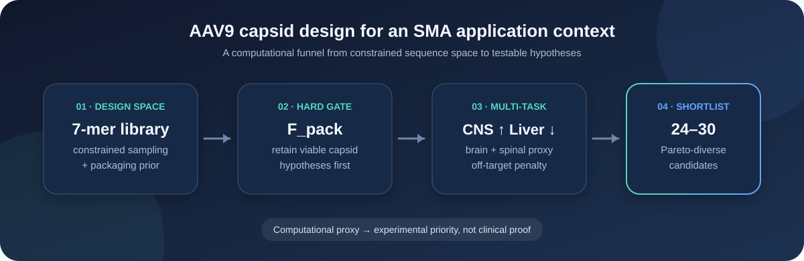
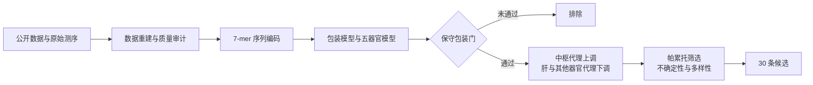

<div align="center">
  <h1>LIFS-Comp_AAV9</h1>
  <p><strong>面向脊髓性肌萎缩症应用场景的 AAV9 衣壳计算设计</strong></p>
  <p>包装约束 · 多器官预测 · 中枢/肝脏权衡 · 多样化候选筛选</p>
  <p>
    <a href="README.md">English</a>
    ·
    <a href="docs/README.md">技术文档</a>
    ·
    <a href="MODEL_CARD.md">模型说明</a>
    ·
    <a href="docs/SUBMISSION_GUIDE.zh-CN.md">提交指南</a>
  </p>
  <p>
    
    
    
    
  </p>
</div>

<p align="center">
  
</p>

## 项目概览

本项目利用公开的 Fit4Function 数据，构建 AAV9 7-mer 插入序列的计算筛选流程。
研究问题是：能否在保留预测包装能力的前提下，优先选择脑和脊髓分布代理较高、
同时肝脏及其他器官分布代理较低的候选衣壳？

项目面向未来的 SMA（脊髓性肌萎缩症）SMN1 递送场景。当前结果是基于小鼠器官数据的
计算候选优先级，不等同于运动神经元特异性、人体有效性或治疗效果。

## 核心结果

| 筛选阶段 | 结果 |
| --- | ---: |
| 确定性虚拟候选池 | 1,000,000 条唯一 7-mer |
| 通过保守包装门 | 6,016 条 |
| 严格帕累托候选 | 169 条 |
| 最终多样化候选面板 | 30 条 |
| 完整保守条件候选 | 7/30 条 |

保留的五模型共享 MLP 集成在记录的 Animal 4 开发留出评估中得到以下 Pearson 相关系数：

| 脑 | 脊髓 | 肝 | 心 | 肾 |
| ---: | ---: | ---: | ---: | ---: |
| 0.554 | 0.571 | 0.785 | 0.458 | 0.635 |

Animal 4 的结果在模型开发期间被查看过，因此属于开发留出评估，不是最终盲测。
完整解释见[评估摘要](docs/EVIDENCE_SUMMARY.md)和[模型说明](MODEL_CARD.md)。

## 计算流程



模型分别预测包装、脑、脊髓、肝、心和肾终点。训练完成后再计算展示分：

```text
F_CNS = 0.50 × F_brain + 0.50 × F_spinal
F_off = 0.50 × F_heart + 0.50 × F_kidney
S     = 0.45 × F_CNS − 0.35 × F_liver − 0.20 × F_off
```

包装下界首先作为资格门；随后使用逐器官预测、帕累托关系、模型分歧和序列距离，
从合格集合中形成多样化候选面板。

## 快速开始

### 1. 安装

已安装 `uv` 时：

```bash
uv sync --frozen --extra dev
source .venv/bin/activate
```

也可以使用 Python 虚拟环境：

```bash
python3 -m venv .venv
source .venv/bin/activate
python -m pip install -e '.[dev]'
```

### 2. 运行自包含示例

```bash
python -m aav9_sma demo --output-dir artifacts/demo
```

该命令使用确定性的合成数据检查数据审计、预测表、包装门和候选排序接口。
它不需要外部研究数据，也不加载历史训练模型。

### 3. 校验已保存结果

```bash
PYTHONPATH=src python scripts/verify_submission.py
```

`integrity_ok` 表示文件校验和结果一致性；`submission_ready` 表示已声明的交付事项
是否全部完成。这两个状态分别报告。

### 4. 运行软件测试

```bash
ruff check .
pytest
```

## 主要文件

| 文件 | 内容 |
| --- | --- |
| [results/results.csv](results/results.csv) | 30 条候选及逐终点预测 |
| [results/results_manifest.json](results/results_manifest.json) | 结果版本、来源和校验值 |
| [MODEL_CARD.md](MODEL_CARD.md) | 模型结构、评估与可用文件 |
| [docs/EVIDENCE_SUMMARY.md](docs/EVIDENCE_SUMMARY.md) | 评估解释和证据范围 |
| [docs/DATA_CONTRACT.md](docs/DATA_CONTRACT.md) | 输入输出字段定义 |
| [docs/audit_data/](docs/audit_data/) | 机器可读评估与数据质量记录 |
| [docs/SUBMISSION_GUIDE.zh-CN.md](docs/SUBMISSION_GUIDE.zh-CN.md) | 提交、校验和打包说明 |

## 仓库结构

```text
LIFS-Comp_AAV9/
├── configs/           # 模型与筛选配置
├── data/              # 本地研究数据目录
├── docs/              # 技术文档与评估记录
├── logs/              # 执行和环境记录
├── results/           # 已保存的候选结果
├── scripts/           # 复现、校验和打包工具
├── src/aav9_sma/      # 核心 Python 源码
├── tests/             # 自动化测试
├── MODEL_CARD.md      # 模型说明
└── README.zh-CN.md    # 中文项目主页
```

## 生成源码压缩包

提交准备发布的文件后运行：

```bash
python scripts/package_submission.py --output submission_packages/source.zip
```

脚本从当前 Git 提交生成压缩包，排除本地环境、缓存、录屏及未跟踪文件，
并附带包含逐文件 SHA256 的 `PACKAGE_MANIFEST.json`。

## 交付状态

仓库保留了源码、配置、输入文件标识、评估记录和既有结果。历史二进制模型权重与同期
训练日志没有留存，因此结果表不能作为模型检查点使用。正式候选模板和项目再分发许可
也仍需确认。当前状态及处理方式见[提交指南](docs/SUBMISSION_GUIDE.zh-CN.md)。

## 数据来源与许可

- Fit4Function 来源和固定版本见 [source_manifest.json](docs/source_manifest.json)。
- 输入文件校验值见 [data_manifest.json](docs/data_manifest.json)。
- 第三方来源与声明见 [THIRD_PARTY_NOTICES.md](THIRD_PARTY_NOTICES.md)。
- 项目自身许可状态见 [LICENSE_STATUS.md](LICENSE_STATUS.md)。
- 完整文档目录见 [docs/README.md](docs/README.md)。

---

<div align="center">
  <strong>从大规模序列空间出发，形成可追溯、可复核的实验候选优先级。</strong>
</div>
